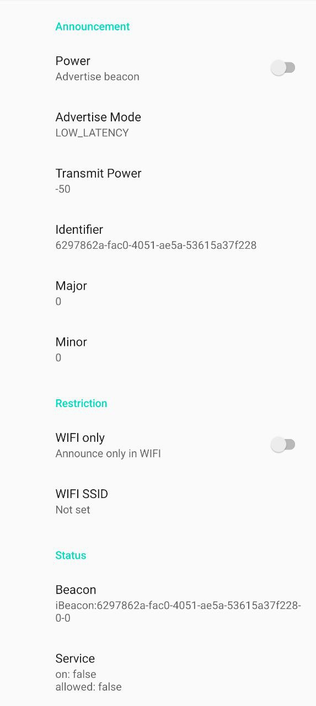

# Android BLE Beacon

Simple Android application that sends an AltBeacon proximity beacon advertisement.

Features
- Announce beacon only when connected to home network
- Written for HomeAssistant ESPresence
- Works with Android 15 App Standby restrictions

Tested on a Pixel 8, Android 15

    

